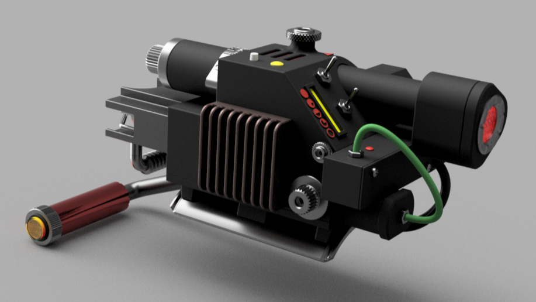
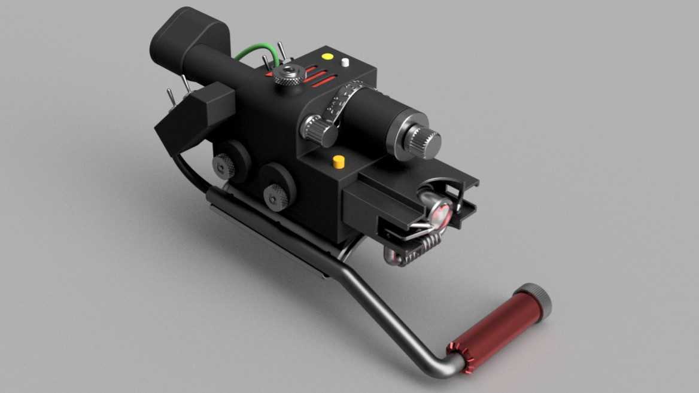

# SBK WRISTBLASTER 3D MODEL
 3D model for 3d printing of Ghostbusters : Frozem Empire inspired Wrist Blaster replica.

 This model is part of the SBK Wrist Blaster Project

   

   

   ## License

Shield: [![CC BY 4.0][cc-by-shield]][cc-by]

This work is licensed under a
[Creative Commons Attribution 4.0 International License][cc-by].

[![CC BY 4.0][cc-by-image]][cc-by]

[cc-by]: http://creativecommons.org/licenses/by/4.0/
[cc-by-image]: https://i.creativecommons.org/l/by/4.0/88x31.png
[cc-by-shield]: https://img.shields.io/badge/License-CC%20BY%204.0-lightgrey.svg

This means:

✅ You are free to share (copy and redistribute) and adapt (remix, transform, build upon) the material.

❌ Commercial use is prohibited without the author's consent.

✅ You must give appropriate credit and link to the original project.

For more details, see the full license text: CC BY-NC 4.0.

## Author & Collaborator
### Author: Samuel Barabé
- 👨‍💻 Father of four, engineer, outdoor enthusiast, and passionate maker.
- 🛠 Addicted to MCU programming, coding, and 3D design.
- 👻 Inspired by the rugged, prototype-like aesthetic of Ghostbusters devices.
- 💡 This project was born from my love for creative electronics, practical prototyping, and immersive props.
- 🎁 I especially love making props for my children, bringing their favorite fictional worlds to life.

### Collaborator: David Miyakawa
- 🎨 Talented graphic designer with a deep love for the Ghostbusters lore.
- 🎶 Major contributor to sound effects design, prop look development and screen-accurate, device work flow.
- 🛠 Skilled in assembling, painting, and finishing props to high-quality standards.
- 💡 David's input has been invaluable in achieving realistic soundscapes, design accuracy, and practical prop assembly.

## Contact

📧 **Email:** [SmartBuildsKits@gmail.com](mailto:SmartBuildsKits@gmail.com)

🌐 **Website:** [https://github.com/SmartBuildsKits](https://github.com/SmartBuildsKits)

## Support

💸 To keep this project alive, you can support us by **purchasing a PCB** or **donating via PayPal**: [Donate via PayPal](https://paypal.me/sbarab?country.x=CA&locale.x=fr_CA).
💻 **Inquiries for PCBs** can be sent to [SmartBuildsKits@gmail.com](mailto:SmartBuildsKits@gmail.com).

---

Enjoy building your wrist blaster! 🚀💥
