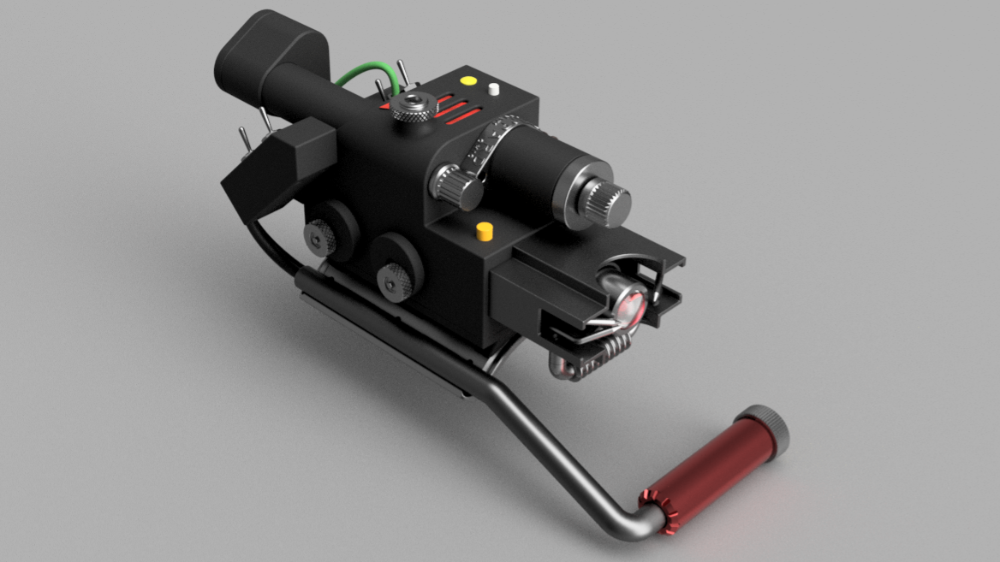

# SBK WRISTBLASTER 3D MODEL
---
**2026-08-06 UPDATE**

3D model updates to **V2**.
- Some interferences fixed.
- Fire Rod LEDs jewel distance from lens was adjusted for better luminosity, a LEDs holder (part #34) was created for this, Rod Box and Lens Holder were adapted too.
- Handle was corrected for 3/8 copper pipe, about 10mm outside diameter.
- Gunbox and base plate modified for last electronic PCBs version.
- Changed parts are marked as V2.
- Some previous electronics PCBs may not fit without model modifications
---
3D model for 3D printing of a *Ghostbusters: Frozen Empire* inspired Wrist Blaster replica.

The 3D model provided is part of this project: [SBK_WRISTBLASTER](https://github.com/SmartBuildsKits/SBK_WRISTBLASTER).

The SBK PCBs are specifically designed to fit this model but can also be used in other designs.

See the **3D printed parts list** and **Other parts list** for details.

I keep a small stock of non-printed parts for personal uses. If you're having trouble sourcing a specific component, feel free to reach out—I might be able to help. **Contact me via email for inquiries**.

 

## License

Shield: [![CC BY 4.0][cc-by-shield]][cc-by]

This work is licensed under a
[Creative Commons Attribution 4.0 International License][cc-by].

[![CC BY 4.0][cc-by-image]][cc-by]

[cc-by]: http://creativecommons.org/licenses/by/4.0/
[cc-by-image]: https://i.creativecommons.org/l/by/4.0/88x31.png
[cc-by-shield]: https://img.shields.io/badge/License-CC%20BY%204.0-lightgrey.svg

This means:

✅ You are free to share (copy and redistribute) and adapt (remix, transform, build upon) the material.

❌ Commercial use is prohibited without the author's consent.

✅ You must give appropriate credit and link to the original project.

For more details, see the full license text: [CC BY 4.0](http://creativecommons.org/licenses/by/4.0/).

## Contact

📧 **Email:** [SmartBuildsKits@gmail.com](mailto:SmartBuildsKits@gmail.com)

🌐 **Website:** [https://github.com/SmartBuildsKits](https://github.com/SmartBuildsKits)

## Support

💸 To keep this project and keep development going, you can **acquire a PCB** or **donate via PayPal**: [Donate via PayPal](https://paypal.me/sbarab?country.x=CA&locale.x=fr_CA).

💻 **Inquiries** can be sent to [SmartBuildsKits@gmail.com](mailto:SmartBuildsKits@gmail.com).

---

Enjoy building your wrist blaster! 🚀💥
