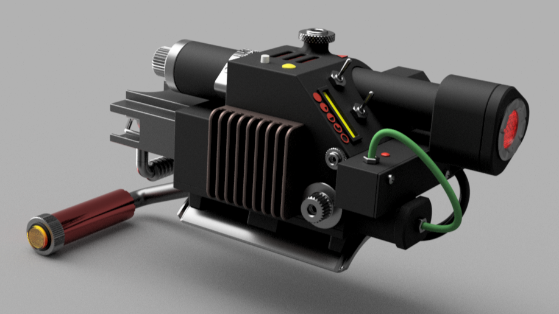

# SBK_WRISTBLASTER
Arduino firmware, electronics, and 3D-printable parts for a custom Wrist Blaster prop inspired by *Ghostbusters: Frozen Empire*.

---
Work in progress :
- 3D model V2 parts list.
- Update electronics parts list.
- Update assembly guide for PCBs : PropCore One V2, BarDrive Max28 V1, BarMeter Sx28.
- New electronic board with SMD parts to make life easier...
- Polyphonic capability : dream board with polyphonic capability and embedded SDCard reader, player, amplifier, power circuits.
  
---
**2026-08-27 UPDATE**
- Firmware release v1.1.0.
- New schematic drawing with SBK PropCore One, BarDrive MAX28 and BarMeter Sx28 PCBs.
  
---

**2026-08-06 UPDATE**

https://github.com/sbarabe/SBK_WRISTBLASTER/blob/main/README.md

3D model updated to V2, see 3D model README file for details.

---

<p>
  
  
</p>

Power Cell battery-pack options:

<p>
  
  
</p>

## Current Firmware Release

**Version 1.1.0**

This release introduces a revised prop workflow, broader hardware support, optional Power Cell displays, and several fixes and internal improvements.

### Highlights in v1.1.0

- Revised power-up, Cyclotron, firing, overheat, venting, and shutdown sequences.
- Predefined pin mappings for several SBK controller boards, plus a custom-pin option.
- Panel bar meter support through either a MAX7219/MAX7221 or HT16K33 driver.
- Optional Power Cell using either:
  - an addressable WS2812 LED strip; or
  - a 24-segment bar meter driven by a MAX72xx or HT16K33.
- Power Cell WS2812 LEDs can share the main LED chain or use a separate output when supported by the selected board.
- Optional battery monitoring and low-battery shutdown on boards with a battery-sense input.
- Configurable switch logic, animation directions, segment mappings, potentiometers, illuminated fire button, and serial debugging.
- Support for DFPlayer communication through SoftwareSerial or the Nano Every hardware `Serial1` interface, depending on the selected board.
- Modularized bar meter drivers and animation engines.
- Smoke support remains optional and experimental; it is disabled by default.

## Overview

`SBK_WRISTBLASTER_CORE` controls the prop's lighting animations, sound effects, switches, indicators, firing modes, heat simulation, and optional accessories.

The repository also includes 3D-printable parts, schematics, example sound effects, and resources for building the complete prop. The SBK PCBs are designed to fit the provided 3D model, but the firmware can also be adapted to other custom prop builds.

## Main Features

- **Sound effects:** DFPlayer Mini playback synchronized with prop states and animations.
- **Addressable lighting:** WS2812 animations for the firing tip, indicators, vent, Cyclotron, and optional Power Cell.
- **Panel bar meter:** Heat-level animation with configurable segment count, direction, and mapping.
- **Two firing modes:** Capture stream at regular Cyclotron power and burst firing at full power.
- **Heat and overheat simulation:** Heat accumulates while firing and cools while idle; extended firing triggers warning and venting sequences.
- **Party Mode:** Plays tracks stored in folder `/01` on the DFPlayer SD card.
- **Optional controls:** Volume and firing-hue potentiometers.
- **Optional battery monitoring:** Configurable battery chemistry, scaling, and low-voltage cutoff.
- **Standalone diagnostics:** The firmware can run without a working audio player, and serial debugging can be enabled in the configuration file.

## Supported Controller Configurations

Select exactly one controller definition in `SBK_WRISTBLASTER_CONFIG.h`.

> **Recommended controller:** The preferred and currently documented PCB for this firmware release is **SBK PropCore ONE Vx** (`SBK_PROPCORE_ONE_Vx`). Its schematic is available in the repository's [`Schematics`](https://github.com/sbarabe/SBK_WRISTBLASTER/tree/main/Schematics) folder. The other definitions are retained for compatibility with earlier boards or custom builds.

| Configuration | Supported MCU | Status and notes |
| --- | --- | --- |
| `SBK_PROPCORE_ONE_Vx` | Arduino Nano or Nano Every | **Preferred configuration.** Matches the currently available GitHub schematic and provides a separate WS2812 Power Cell output and battery-sense input. |
| `SBK_WRIST_BLASTER_PCB_V2` | Arduino Nano Every | Legacy board support; no dedicated Power Cell or battery-monitoring connection. |
| `SBK_WRIST_BLASTER_II_PCB_Vx` | Arduino Nano or Nano Every | Legacy board support; no dedicated Power Cell or battery-monitoring connection. |
| `SBK_PROPCORE_ONE_PLUS_Vx` | Arduino Nano Every | Alternate/extended configuration using hardware `Serial1`, a dedicated Power Cell bar meter interface, and a battery-sense input. |
| `CUSTOM_PINS_DEFINITION` | User-defined | Advanced custom builds; edit the dedicated custom section in `SBK_WRISTBLASTER_PINS_DEF.h`. |

## Hardware Requirements

> **Estimated electronics cost:** Makers sourcing the components themselves should expect approximately **$100–140 USD**, including a **7.2 V NiMH battery pack**. Actual cost depends on suppliers, shipping, component availability, and PCB quantities. This estimate excludes 3D-printing material, hardware, straps, and cosmetic parts.

See the electronic parts list in the `Resources` folder for complete details. A typical build uses:

- Arduino Nano Every.
- Genuine DFRobot DFPlayer Mini DFR0299 and a microSD card.
- Populated SBK controller PCB.
- Four miniature toggle switches, with the Intensify control optionally replaced by a push button.
- Five individual WS2812 pixels.
- Two 7-pixel WS2812 jewels.
- One 16 mm momentary fire button with a yellow LED, such as the R16-503.
- One 28-segment bar meter, such as the BL28-3000-Sx04Y.
- Compatible MAX7219/MAX7221 or HT16K33 bar meter driver hardware.
- One 2-inch, 3-5 W, 4-ohm speaker (check speaker footprint with the 3D model).
- A suitable 6–12 V power source; a 7.2 V NiMH flat pack is recommended for the provided battery holder.

Optional components include:

- One B10K potentiometer for volume **RECCOMENDED**.
- One B10K potentiometer for firing-strobe hue.
- An 8-pixel WS2812 Power Cell strip or a 24-segment Power Cell bar meter.
- Smoke and fan hardware for experimental smoke effects.

### SBK PCBs

- Main controller: **SBK Wrist Blaster PCB II** or **SBK PropCore ONE/ONE+**, according to the build.
- Common-cathode bar meter driver: **SBK BarMeter SK28 V1**.
- Common-anode bar meter driver: **SBK BarMeter SA28 V1**.
- 28-segment bar meter driver: **SBK BarDrive MAX28 V1** or **SBK BarDrive HT28 V1**.
- Optional 24-segment Power Cell bar meter and driver PCBs.

PCBs are produced in small batches and on demand. For availability, contact [SmartBuildsKits@gmail.com](mailto:SmartBuildsKits@gmail.com).

## Firmware Installation

### 1. Download the project

- Download the repository ZIP from [SBK_WRISTBLASTER](https://github.com/sbarabe/SBK_WRISTBLASTER), or clone the repository.
- Extract the files.

### 2. Install the sketch and bundled engine files

- Copy the `SBK_WRISTBLASTER_CORE` folder into your Arduino sketchbook.
- Move the bundled `SBK_WristBlaster_lib` folder into the Arduino sketchbook `libraries` folder.

The final structure should resemble:

```text
Arduino/
├── libraries/
│   └── SBK_WristBlaster_lib/
└── SBK_WRISTBLASTER_CORE/
    ├── SBK_WRISTBLASTER_CORE.ino
    ├── SBK_WRISTBLASTER_CONFIG.h
    └── SBK_WRISTBLASTER_PINS_DEF.h
```

### 3. Install external libraries

Using the Arduino IDE Library Manager, install:

- **Adafruit NeoPixel**
- **DFPlayerMini_Fast**

Install all dependencies requested by the Arduino IDE.

### 4. Configure the firmware

Open `SBK_WRISTBLASTER_CONFIG.h` and select exactly one PCB configuration:

```cpp
// Define exactly one:
// #define CUSTOM_PINS_DEFINITION
// #define SBK_WRIST_BLASTER_PCB_V2
// #define SBK_WRIST_BLASTER_II_PCB_Vx
#define SBK_PROPCORE_ONE_Vx
// #define SBK_PROPCORE_ONE_PLUS_Vx
```

Then review the remaining configuration sections for your build:

- switch and button type and logic;
- panel bar meter driver, direction, segment count, and mapping;
- WS2812 LED count and indexes;
- Power Cell type, driver, direction, and mapping;
- smoke effects, which are experimental and disabled by default;
- volume and firing-hue potentiometers;
- battery type, voltage scaling, and low-battery cutoff;
- DFPlayer volume, timing, and track durations;
- serial debugging.

> **Important:** Audio sequencing normally uses the track durations defined in `SBK_WRISTBLASTER_CONFIG.h`. Incorrect durations can desynchronize the sound and animations. BUSY-pin timing is available for experimentation but is not recommended by default.

Avoid modifying `SBK_WRISTBLASTER_CORE.ino`. For custom wiring, select `CUSTOM_PINS_DEFINITION` and edit only its dedicated section in `SBK_WRISTBLASTER_PINS_DEF.h`.

### 5. Compile and upload

- Open `SBK_WRISTBLASTER_CORE.ino` in the Arduino IDE.
- Select the board that matches the chosen controller configuration.
- Select the correct serial port.
- Compile and upload the sketch.

## Sound Effects and SD Card Setup

The provided example sound effects match the track numbers and default durations in the firmware configuration.

The DFPlayer identifies root-folder tracks by their copy order rather than reliably by filename. Start with a freshly formatted microSD card and copy the required root tracks to it one at a time, in numerical order.

Place additional music tracks in folder `/01`; these are used by Party Mode.

If you replace or edit a sound file, update its duration in `SBK_WRISTBLASTER_CONFIG.h` so the corresponding animation remains synchronized.

### Sound-effects disclaimer

The example sound effects are derived from *Ghostbusters* films and games and remain the property of their respective copyright holders. They are provided as edited examples for this fan project. You are responsible for ensuring that your use complies with applicable copyright law.

## Controls and Operation

- **Main Power:** Turns the blaster on or starts the shutdown sequence.
- **Cyclotron Power:** Starts the Cyclotron and enables regular-power Capture firing.
- **Activate:** Raises the Cyclotron to full power and enables Burst firing.
- **Fire Button:** Starts the firing sequence for the currently selected power level.
- **Intensify:** Enters or exits Party Mode. It can be configured as either a push button or a switch.
- **Party Mode navigation:** Short-press Fire for the next track; long-press Fire for the previous track.
- **Overheat:** Repeated Burst shots or a long Capture stream can trigger an overheat warning, venting sequence, and system restart.

When experimental smoke support is compiled in, hold the Fire button while the blaster is in the Power Off state to view or change the smoke-enable status. The top white indicator displays green when enabled and red when disabled.

## 3D Model Design Choices

The model aims for the rugged, prototype-like appearance of the *Frozen Empire* prop while making several practical changes:

- The Intensify control may be built as a switch because its original push-button position is difficult to reach while the blaster is worn on the right arm.
- The straps pass between the main body and the arm-brace plate, leaving more internal room for the electronics and speaker.
- The arm-brace plate is curved to accept a 3/8-inch copper-pipe handle secured through the plate holes.
- The indicator lenses use modern, readily available parts.
- The fire button includes a yellow indicator LED.
- The front knob and Clippard-valve knob can optionally control volume and firing hue.

See the README in the `3D model` folder for model-specific information and revision notes.

## Schematics

Schematics in the `Schematics` folder show the wiring for the supported SBK controller, BarDrive, and BarMeter PCBs. Confirm that the schematic revision matches your controller selection and firmware configuration before assembly.

## Demo Video

🎥 [Watch the demo video](https://drive.google.com/file/d/1tK8gQD61fCHybJHeq_SOud1DNxneKH4g/view?usp=sharing)

## Contributing

Pull requests are welcome. Please fork the repository, test your changes on the intended hardware, and describe the controller and configuration used for testing.

## License

- The firmware source files identify the code as licensed under the **MIT License**.
- The repository-level `LICENSE` file covers the remaining project material under **Creative Commons Attribution 4.0 International (CC BY 4.0)**.
- Included or referenced *Ghostbusters* media remains the property of its respective copyright holders and is not relicensed by this project.

See the repository `LICENSE` file and the headers of individual source files for the terms that apply to each item.

## Author and Collaborator

### Author: Samuel Barabé

Engineer and maker focused on embedded programming, electronics, 3D design, and immersive props.

### Collaborator: David Miyakawa

Graphic designer and *Ghostbusters* enthusiast who contributed to sound design, prop appearance, screen-inspired workflow, assembly, painting, and finishing.

## Contact and Support

- Email and PCB inquiries: [SmartBuildsKits@gmail.com](mailto:SmartBuildsKits@gmail.com)
- GitHub: [sbarabe](https://github.com/sbarabe)
- Donations: [PayPal](https://paypal.me/sbarab?country.x=CA&locale.x=fr_CA)

---

Enjoy building your Wrist Blaster!
