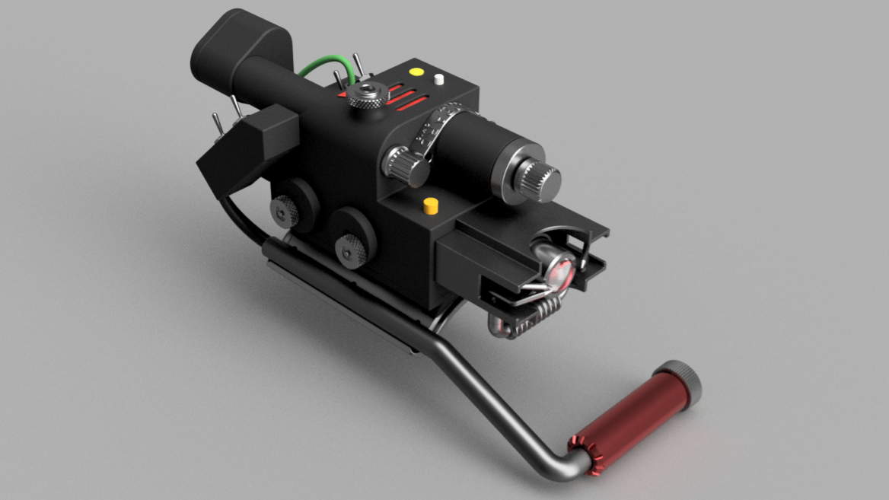

# SBK_WRISTBLASTER
Wrist Blaster rendering :

    

Arm braced Power Cell battery pack holder for Wrist Blaster, 8 pixels WS2812 stick version, and 24 segements Bar Meter version :

       

## Overview

This project is for a custom-built wrist blaster prop, inspired by the *Ghostbusters: Frozen Empire* movie.

The **SBK_WRISTBLASTER_CORE** firmware is designed to control LED animations, sound effects, and mechanical features using an Arduino Nano Every.

A 3D model is provided for 3D printing parts for this project. While the SBK PCBs are designed to fit this model, they can also be used in other designs.

The provided schematics utilize the SBK PCBs for easier assembly. Due to the restricted space inside the blaster, using these PCBs ensures that all components fit neatly inside.

This project is intended for prop enthusiasts, cosplayers, and makers who want to create a realistic and interactive wrist blaster with dynamic lighting effects and customizable sound.

## Features

- 🎶 **Sound Effects:** Controlled using a DFPlayer Mini.
- 💡 **LED Animations:** Custom LED bar meters, cycling lights, and pulsating effects.
- 🔥 **Heat Level Simulation:** LED bar that rises with the "heat level" and gradually cools down when not in use.
- 🎛 **Potentiometer Control:** Adjust volume and firing strobe hue.
- 📟 **MAX7219 or HT16K33 Support:** bar meter driver using MAX7219 or HT16K33 LEDs driver.
- 🎮 **Standalone Operation:** The code can run without a functional player, making debugging easier.
- 📊 **Serial Debugging:** Real-time debugging through the Arduino IDE.
- 💨 **Vacuum Pump and Fan Outputs:** Dedicated 5V outputs (0.5A max each) for controlling smoke effects, fully integrated on the PCB.

   ***Note about Smoke Effect:***
  
  We have not yet found an ideal combination of pump, fan, and smoke device that is small enough to fit inside the blaster while providing a    satisfactory smoke effect. We're actively working on this and therefore do not currently recommend any specific device combination.

   However, the board includes two outputs dedicated to smoke effect control. These outputs are driven simultaneously and can be used to power a pump and fan directly (as long as the devices are within the board’s rated voltage and current limits). Alternatively, you can use these outputs to drive a relay or other interface to control your smoke devices.

   If you discover a combination that delivers a good smoke effect in this setup, we’d love to hear from you!

## 3D Model Design Features and Choices  

While aiming for screen accuracy in the *Ghostbusters* inspired Wrist Blaster design,some modifications have been made for usability and practicality. We envision this version as an evolution of the first prototype seen in *Frozen Empire*:  

- The **Activate Push Button** has been replaced with a switch. The original push button's position was difficult to reach when the blaster was strapped to the right arm. You can still use the push button if desired by setting **INTENSIFY_IS_A_SWITCH** to **false** in the config file.  
- The straps do not pass through the main body but instead go between the main body and the arm brace plate. This design provides more internal space for electronics and the speaker.  
- The arm brace plate is curved to accommodate a 3/8" copper pipe as a handle, which can be secured with zip ties through the plate holes.  
- Indicator plastic lenses have a modern style and are easily available from suppliers like Digi-Key or Mouser.  
- The fire button features a yellow light indicator.  
- **Optional features:**  
  - **Volume control:** Adjustable via the front knob and potentiometer.  
  - **Fire strobe hue control:** Adjustable using the Clippard valve knob and potentiometer.  
  - **Smoke effect:** The intended setup includes a fan inside the heatsink, a pump inside the Clippard valve body, and a vacuum-activated vape system inside the Cyclotron tube. The board provides two operational outputs to control the fan and pump simultaneously. These can be used directly (within rated voltage and current limits) or through a relay. ***That said, we haven't find yet a good combinaison of smoke devices (fan, pump, and vape system) smal enough to fit inside the blaster and providing good smoke effects.***

 
    
## Hardware Requirements
See the ***Electronic Parts List*** in the ***Ressources*** folder for full details, here are the main components :
- **Arduino Nano Every** (not to be confused with the regular Nano)
- **DFPlayer Mini DFR0299 (genuine)** and an SD card
- **A fully populated custom SBK Wristblaster PCB** 
- **4x Mini Blue Toggle Switches** (or replace one switch with a push button for the "Activate")
- **5x WS2812 Single LED Pixels**
- **2x WS2812 7-LED Jewels**
- **1x 16mm Momentary Push Button with Yellow LED Indicator** (R16-503)
- **1x 28-Segment Bar Meter** (BL28-3000-Sx04Y)
- **1x 2in 5W 4Ohms speaker**
- **Proper LED Driver PCBs for the Bar Meter** (using HT16K33 or MAX72xx drivers). We recommend using the **SBK BarDrive SK28 V2.0** and **SBK BarMeter 28 V0** PCBs with MAX7221 LED drivers.
- **6-12V Power Pack:** We suggest using a 6V NiMh flat pack that fits the battery holder 3D model in this project, but you may choose your own power source.
- Options :
   - **1x B10K Potentiometers** for volume control 
   - **1x B10K Potentiometers** for fire strobe hue control
   - **1x 3006 or 3007 5VDC fan** for smoke effect
   - **1x 5VDC mini pump** for smoke effect
   - **1x small vape pen, vacuum activated** for smoke effect

### SBK PCBs
- Main PCB :                                       **SBK_WRISTBLASTER_PCB_II V0.2**
- Driver PCB for **common cathode** bar meter :    **SBK BarDrive SK28 V2.0**
- Driver PCB for **common anode** bar meter :      **SBK BarDrive SA28 V2.0**
- Bar meter holder PCB for BL28-3005Sx bar meter : **SBK BarMeter 28 V0**
  
  PCBs are produced in small batches and on demand, with only a small amount kept in stock.
  
  💻 ***Inquiries for PCBs*** can be sent to [SmartBuildsKits@gmail.com](mailto:SmartBuildsKits@gmail.com).

## Firmware Installation

1. **Download the files:**

- Go to the GitHub repository: [SBK_WRISTBLASTER](https://github.com/SmartBuildsKits/SBK_WRISTBLASTER)
- Click on the **Code** button and select **Download ZIP**.
- Extract the ZIP file to your computer.

2. **Move the files to the correct folders:**

- Copy the **SBK_WRISTBLASTER_CORE** folder inside your Arduino IDE **Sketches** folder.
- In that folder, you will find another folder named **SBK_WristBlaster_lib**, move it inside your Arduino IDE **Sketches\libraries** folder.

3. **Install required libraries:**

- Open Arduino IDE and use the **Library Manager** to install the following libraries along with all their dependencies:
    - **Adafruit_NeoPixel.h**
    - **DFPlayerMini_Fast.h**

4. **Upload the code:**

- From the Arduino IDE Sketches folder, open **SBK_WRISTBLASTER_CORE.ino** in Arduino IDE.
- You'll see two tabs: the **CONFIG** file and the **CORE** file.
- **Do not modify the main code file** (**SBK_WRISTBLASTER_CORE.ino**) : it is designed to remain untouched.
- Review and modify your settings in **SBK_WRISTBLASTER_CONFIG.h** according to your build.
- Connect your Arduino Nano Every to your computer using a suitable USB cable.
- Select the correct **COM port** and set **Arduino Nano Every** as your board.
- Upload the sketch.

## Sound Effects

Sound effects examples are provided for this project. They fit the tracks numbers and lengths defined in the firmware config file. Since DFPlayer play file not by name but by the order they have been written on the SD card, each sound effect should be placed one by one in the correct order on clean formated SD card root folder. 
Additional tracks can be placed in a named "/01" folder of the SD card; these tracks will play in Party Mode.

**Disclaimer**: The sound effects in this project are derived from the *Ghostbusters* movies and video games, which are commonly available within the *Ghostbusters* community. These sounds are not owned by me, and the original works are copyrighted by their respective owners. The sound effects here have been edited, cut, and remixed for use in this project. No copyright infringement is intended. It is your responsibility to ensure that your use of these sound effects does not violate copyright laws.

## Usage

- **Power On:** Flip the main power switch.
- **Cyclotron On:** Flip the cyclotron switch, you can fire when switch is on.
- **Fire Type:** Flip Activate Switch to select between Capture or Burst Fire.
- **Fire :** Press the trigger button to initiate the firing sequence with synchronized LEDs and sound effects.
- **Overheat:** Blaster will overheat, vent and reboot after a few Burst shots or a long Capture shot. Blaster is cooling down while in idle...
- **Party Mode:** Engage in playback mode. Use Fire Button to switch track :
   -  **Short press** → Next track
   -  **Long press** → Previous track
- **Smoke:** While in the **Power Off state**, press and hold the Fire Button for **3 seconds** to enable or disable the smoke device. The **Top White Indicator** will change color to show the status:
   - **Green** → Smoke device enabled
   - **Red** → Smoke device disabled

## Schematics

The provided schematics show the wiring using the SBK custom PCBs, making the assembly easier and cleaner. Using the *SBK BarMater 28* for the bar meter and the *SBK BarDrive xx28* with MAX72xx simplifies the Bar Meter connections. The fan and vacuum pump are also directly powered from the PCB's dedicated 5V-500mA outputs, flyback diodes should be installed between positive and negative wires of these devices for circuit protection.

## Demo Video

🎥 [Watch the demo video](https://drive.google.com/file/d/1tK8gQD61fCHybJHeq_SOud1DNxneKH4g/view?usp=sharing)

## Contributing

Pull requests are welcome! If you'd like to contribute to improving this project, please fork the repository and submit your changes.

## License

Shield: [![CC BY 4.0][cc-by-shield]][cc-by]

This work is licensed under a
[Creative Commons Attribution 4.0 International License][cc-by].

[![CC BY 4.0][cc-by-image]][cc-by]

[cc-by]: http://creativecommons.org/licenses/by/4.0/
[cc-by-image]: https://i.creativecommons.org/l/by/4.0/88x31.png
[cc-by-shield]: https://img.shields.io/badge/License-CC%20BY%204.0-lightgrey.svg

This means:

✅ You are free to share (copy and redistribute) and adapt (remix, transform, build upon) the material.

❌ Commercial use is prohibited without the author's consent.

✅ You must give appropriate credit and link to the original project.

For more details, see the full license text: CC BY-NC 4.0.

## Author & Collaborator
### Author: Samuel Barabé
- 👨‍💻 Father of four, engineer, outdoor enthusiast, and passionate maker.
- 🛠 Addicted to MCU programming, coding, and 3D design.
- 👻 Inspired by the rugged, prototype-like aesthetic of Ghostbusters devices.
- 💡 This project was born from my love for creative electronics, practical prototyping, and immersive props.
- 🎁 I especially love making props for my children, bringing their favorite fictional worlds to life.

### Collaborator: David Miyakawa
- 🎨 Talented graphic designer with a deep love for the Ghostbusters lore.
- 🎶 Major contributor to sound effects design, prop look development and screen-accurate, device work flow.
- 🛠 Skilled in assembling, painting, and finishing props to high-quality standards.
- 💡 David's input has been invaluable in achieving realistic soundscapes, design accuracy, and practical prop assembly.

## Contact

📧 **Email:** [SmartBuildsKits@gmail.com](mailto:SmartBuildsKits@gmail.com)

🌐 **Website:** [https://github.com/SmartBuildsKits](https://github.com/SmartBuildsKits)

## Support

💸 To keep this project and keep development going, you can **acquire a PCB** or **donate via PayPal**: [Donate via PayPal](https://paypal.me/sbarab?country.x=CA&locale.x=fr_CA).

💻 ***Inquiries for PCBs*** can be sent to [SmartBuildsKits@gmail.com](mailto:SmartBuildsKits@gmail.com).

---

Enjoy building your wrist blaster! 🚀💥

